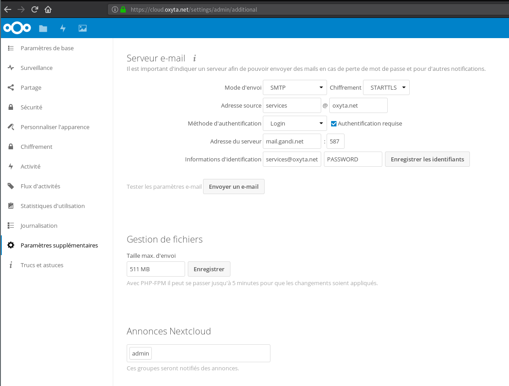

# Install msmtp

```
apt install -y msmtp
```
# Configure

`/etc/msmtprc`:
```
account default
host mail.gandi.net
auth on
from services@oxyta.net
user services@oxyta.net
password $PASSWORD
tls on
tls_trust_file /etc/ssl/certs/ca-certificates.crt

aliases /etc/aliases

syslog LOG_MAIL
```

`/etc/aliases`:
```
root: services+root-$HOSTNAME@oxyta.net
default: services+$HOSTNAME@oxyta.net
```

# Test

`echo "test." | msmtp -a default root`

check [Gandi Webmail](https://webmail.gandi.net/)

# Gitlab

`/srv/gitlab/app/config/gitlab.rb`
```
gitlab_rails['smtp_enable'] = true
gitlab_rails['smtp_address'] = "mail.gandi.net"
gitlab_rails['smtp_port'] = 587
gitlab_rails['smtp_authentication'] = "plain"
gitlab_rails['smtp_enable_starttls_auto'] = true
gitlab_rails['smtp_user_name'] = "services@oxyta.net"
gitlab_rails['smtp_password'] = "$PASSWORD"
gitlab_rails['smtp_domain'] = "oxyta.net"
gitlab_rails['gitlab_email_from'] = 'git@oxyta.net'
gitlab_rails['gitlab_email_reply_to'] = 'services+git@oxyta.net'
```
`docker exec git_app_1 gitlab-ctl reconfigure`

# Nextcloud

[https://cloud.oxyta.net/settings/admin/additional](https://cloud.oxyta.net/settings/admin/additional)


